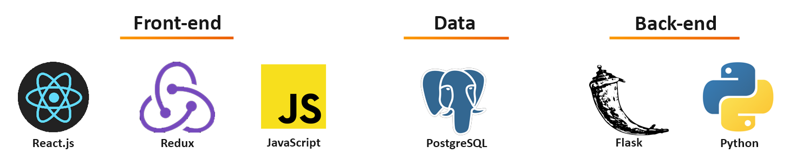

## Сервис бронирования отелей "МИР"

МИР - это веб-приложение, позволяющее подбирать отели и туры, а также осуществлять их бронирование. 

## Инструменты

Перечисление инструментов использованных в процессе разработки:

* **Front-end** - В качестве основного фреймворка используется React. Для управления состояниями применяется Redux.
* **Back-end** - Python является основным языком для всех сервисов. Фреймворком выбран Flask.
* **Data** - Все данные хранятся с применением PostgreSQL. 

## Зависимости

Для запуска проекта требуются следующие компоненты:

* [Node 10 or greater](https://nodejs.org/en/download/)
* [React](https://react.dev/learn/add-react-to-an-existing-project)
* [Sass](https://www.npmjs.com/package/sass)
* [Python 3.7 or greater](https://realpython.com/installing-python/)
* [Flask](https://flask.palletsprojects.com/en/2.3.x/installation/)
* [Docker](https://docs.docker.com/install/)

## Запуск

### `npm start`

Запускает приложение в режиме разработки.\
Для просмотра необходимо открыть [http://localhost:3000](http://localhost:3000) в браузере.

Страница будет обновляться автоматически при внесении изменений.\
Кроме того в консоли будут отображаться lint ошибки.
